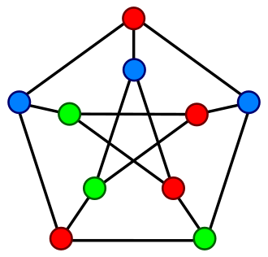

# TP1 — Grafos 🧮


## 🎯 Objetivo

Implementação de **estruturas e algoritmos de Grafos** para o Trabalho Prático 1 de **Teoria dos Grafos e Computabilidade**. O sistema permite criar grafos e operar sobre eles em **duas representações** — **Matriz de Adjacências** e **Lista de Adjacências** — oferecendo operações essenciais de construção, consulta e busca.

<div align="center" style="">
  
</div>


> **Escopo:** criação/remoção de vértices e arestas, consulta de vizinhos, **fecho transitivo direto e inverso**, **busca em profundidade (DFS)**, **busca em Largura (BFS)** e impressão do grafo.


## 👨‍🎓 Integrantes da equipe

* [**Augusto Stambassi Duarte**](https://github.com/Stambassi)
* [**Davi Cândido de Almeida**](https://github.com/DaviKandido)
* [**Gabriela de Assis dos Reis**](https://github.com/GabrielaReiss)
* [**Lucas Carneiro Nassau Malta**](https://github.com/lucascarneiro1202)
* [**João Pedro Torres**](https://github.com/Towers444)
* [**Vitor Leite Setragni**](https://github.com/VitorSetragni)

## 👩‍🏫 Professores responsáveis

* *Silvio Jamil Ferzoli Guimaraes*

## 🗂 Estrutura do Projeto

```
Codigos/
 ├─ Main.cpp                      # menu principal (seleção Matriz/Lista)
 ├─ Visao/
 │   ├─ MenuMatriz.cpp            # interface de operações para Matriz de Adjacências
 │   ├─ MenuLista.cpp             # interface de operações para Lista de Adjacências
 │   └─ MyIO.cpp                  # utilitários de entrada/validação
 ├─ EstruturaDeDados/
 │   └─ IGrafo.cpp                # interface/base com operações comuns
 │   └─ Lista               
 │     └─ GrafoLista.cpp          # implementação via lista 
 │   └─ Matriz
 │     └─ GrafoMatriz.cpp         # implementação via matriz
 │   └─ util
 │     └─ utils.cpp               # Estruturas e definições utilitárias para o manejo dos algoritmos de busca em grafos
 │
 ├─ .clang-format                 # Formatador de codigo c++ via clang-format
 └─ libs
    └─ /io.hpp                    # utilitários de I/O
```

## 🚀 Como Executar

### Opção A — usando **npm scripts** (requer Node.js + g++)

No diretório `Codigos/`:

```bash
# Instale dependências de dev (apenas para comandos utilitários)
npm install

# Compilar
npm run build:linux   # Linux/macOS
npm run build:win     # Windows (MinGW/WSL ou g++ disponível)

# Executar
npm run run:linux     # Linux/macOS
npm run run:win       # Windows

# Compilar + Executar 
npm run dev:linux     # Linux/macOS
npm run dev:win       # Windows
```

### Opção B — compilação manual (g++ / C++17)

Ainda no diretório `Codigos/`:

```bash
# Linux/macOS
mkdir -p bin && g++ Main.cpp -o bin/Main -std=c++17 -Wall -g && ./bin/Main

# Windows (PowerShell)
mkdir bin; g++ Main.cpp -o bin\\Main.exe -std=c++17 -Wall -g; .\\bin\\Main.exe
```

> Caso esteja usando **VS Code**, há tarefas em `.vscode/tasks.json` para compilar/executar.

## 🛠️ Tecnologias Utilizadas

* **C/C++ (C++17)**
* **g++** para compilação
* **VS Code** (configurações em `.vscode/`)
* **Node + npm** (scripts utilitários via `package.json` usando `shx`)

## 📋 Funcionalidades Principais

* **Criação de grafos** com parâmetros:

  * direcionado/não direcionado
  * vértices ponderados e/ou rotulados
  * arestas ponderadas e/ou rotuladas
    
* **Operações sobre o grafo** (menus `Matriz` e `Lista`):

  * Adicionar / Remover **Vértice**
  * Adicionar / Remover **Aresta**
  * **Consultar vizinhos** de um vértice
  * **Fecho transitivo direto** e **inverso** de um vértice
  * **Busca em Profundidade (DFS)**
  * **Busca em Largura (BFS)**
  * **Imprimir** a estrutura do grafo
* **Dados de teste**: opção no menu para **criar um grafo de exemplo** rapidamente.

## 🧭 Como usar (fluxo sugerido)

1. Inicie o programa e escolha a representação (**Matriz** ou **Lista**).
2. Use **Instanciar Grafo** para definir tamanho e propriedades (direcionado/ponderado/rotulado).
3. **Adicione vértices** e **arestas**.
4. Explore as consultas: **vizinhos**, **fechos transitivos**, **DFS** e **BFS**.
5. Use **Imprimir Grafo** para inspecionar a estrutura.
6. Ao final, **Remover Grafo** libera os recursos.

## 🧩 Exemplos de uso (menu)

* `1) Instanciar Grafo`
* `2) Criar grafo de teste`
* `3) Adicionar Vértice`
* `4) Adicionar Aresta`
* `7) Consultar Vizinhos de um Vértice`
* `8) Fecho Transitivo Direto`
* `9) Fecho Transitivo Inverso`
* `10) Busca em Profundidade (DFS)`
* `11) Busca em Largura (BFS)`
* `12) Imprimir Grafo`
* `13) Remove Grafo`

## ✅ Requisitos

* **g++** com suporte a **C++17**
* **Windows/Linux/macOS**
* (Opcional) **Node.js** para usar os *scripts* de build (`npm run`)

## 🧪 Testes rápidos

Após compilar, você pode optar por **Criar grafo de teste** no menu para validar as operações de impressão, vizinhança, DFS e BFS.

## 🧹 Limpeza e Formatação

Na pasta `Codigos/`:

```bash
npm run clean        # remove bin/
npm run format-all   # format C++ com clang-format (se instalado)
```

## 📄 Licença

Este projeto está licenciado sob a **MIT License** — ver arquivo `LICENSE`.
